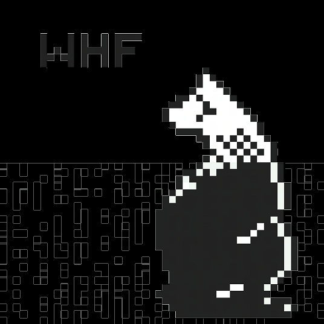

# serenityos-icons
### Unofficial SerenityOS Icon Themes 



Image above is my rendition of SerenityOS's catdog in 
pixelart (I tried :^) )

This repo is my humble effort to try and produce icons for SerenityOS. 
All my icons are made using SerenityOS's own Pixel Paint 
application (where possible).

### How to install
* Copy contents of `Base/res/icon-themes/[Theme-Name]/{16x16,32x32}` 
overwriting those of $SERENITY_SOURCE_DIR/Base/res/icons/{16x16,32x32}

```sh
# ensure current dir is $SERENITY_SOURCE_DIR
$ pwd

# Initialization
# Make a Default theme
$ cp -r Base/res/icons/ Base/res/icon-themes/Default

# enable Default theme always
$ cp -r Base/res/icon-themes/Default/* Base/res/icons/

# now use selected icon theme
$ cp -r Base/res/icon-themes/Black-and-White/* Base/res/icons/

# exec serenity.sh run
$ Meta/serenity.sh run

```
* Executing `$SERENITY_SOURCE_DIR/Meta/serenity.sh run` should create 
an image `_disk_image` for QEmu to load and run
* Source PixelPaint files are on `pp/` folder, inside the icon-
theme name, i.e. *Songbyrrd*, *BlueByrrd*
* It is recommended to try out these icons on a separate branch:
```sh
$ git clone https://github.com/serenityos/serenity
$ cd serenity
$ git pull
$ git clone -b branch-using-custom-icons
```
* Use the branch `branch-using-custom-icons` for example and copy
over the icons into serenity as mentioned above.
* This is still a work-in-progress, and may always remain so even
into the forseeable future. :^)

## Note:
I may only update the PixelPaint source files since one can
easily generate the final icons by exporting it as .png files.

## Songbyrrd Icon Theme pack (work-in-progress)
A SerenityOS (custom) icon theme with flat, minimalist look and
style. This is my initial attempt at Icon Theme creation as I have
zero background/experience making them.

## Bluebyrrd Icon Theme pack (work-in-progress)
A blue color variant of Songbyrrd. Same description applies.

## Black-and-White Icon Theme Pack
@Xexxa's Icon Theme pack currently under PR for SerenityOS

## Compression
You can further optimize disk usage by compressing .png files
using `optipng -nb -nc -np [filename]`
